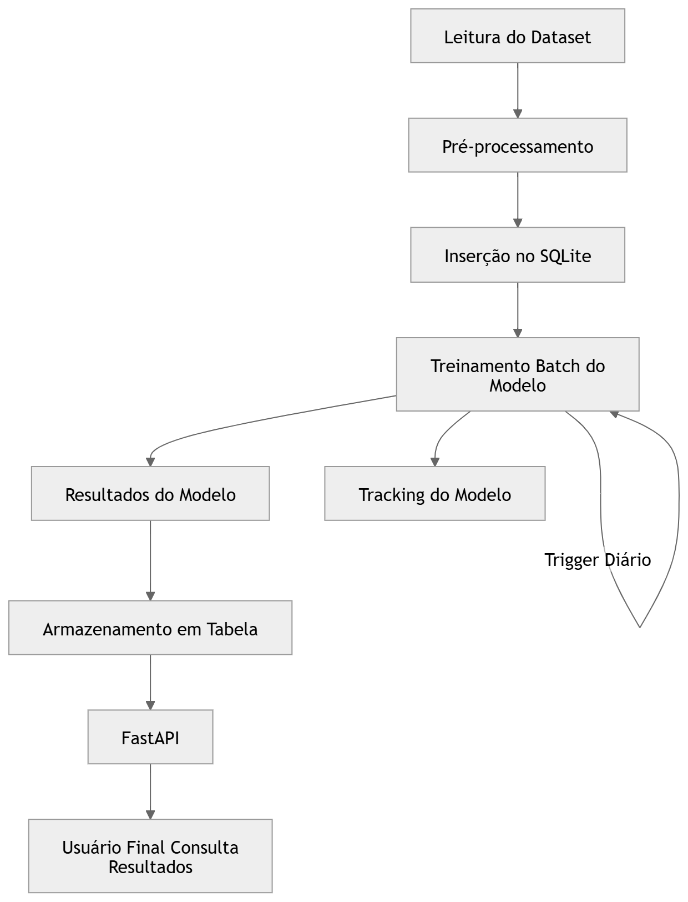
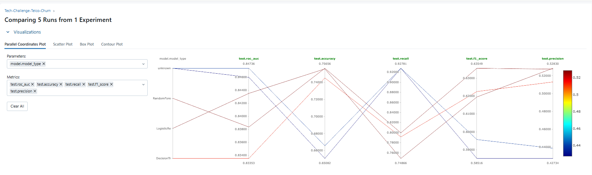
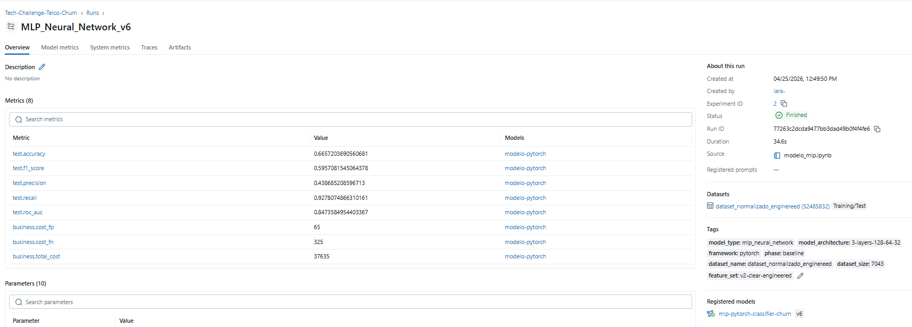

# 📊 Tech Challenge | Modelo Preditivo de Churn

[](https://www.python.org/)
[](https://mlflow.org/)
[](https://pytorch.org/)
[](LICENSE)


## 🔶 Objetivo
Desenvolver um modelo de classificação binária para identificar clientes com alto risco de cancelamento, permitindo intervenções proativas da equipe de CRM e Marketing.

## 🔶 Fluxo de Trabalho (End-to-End)

O diagrama abaixo ilustra o ciclo de vida dos dados, desde a ingestão até a disponibilização dos insights via API.



[▫️Clique aqui para ter mais detalhes sobre a arquitetura](./docs/arquitetura.md)

## 🔶 Organização do repositório
```text
PROJETO-TECH-CHALLENGE-CHURN/
├── data/  
|    ├── raw/                       # Dados brutos
|    ├── processed/                 # Dados processados
├── docs/                           # Documentação técnica e de negócio
│   ├── imgs/                       # Imagens utilizadas na documentação
│   ├── mlflow_screenshots/         # Evidências do tracking de experimentos no MlFlow
│   ├── arquitetura.md              # Design da arquitetura
│   ├── model_canvas_business.md    # Business Model Canvas
│   ├── model_card.md               # Detalhes técnicos do modelo
│   └── results.md                  # Relatório de métricas e performance - MlFLow
|   └── plano_de_monitoramento.md   # Plano de monitoramento do modelo
├── logs/                           # Registros de execução do pipeline
├── models/                         # Modelos treinados (.pt) e pré-processadores (.pkl)
├── notebooks/                      # EDA e experimentação inicial
│   └── outputs/                    # Gráficos e resultados de notebooks
│   └── analise_EDA.ipynb           # notebook de análise exploratória
│   └── analise_teste_hipotese.ipynb# notebook de análise de testes de hipótese
│   └── modelo_mlp.ipynb            # notebook com o modeo mlp
│   └── modelos_baseline.ipynb      # notebook com os modelos de baseline testados  
├── src/                            # Código-fonte produtivo
│   ├── app.py                      # API/Interface da aplicação
│   ├── ingest.py                   # Módulo de coleta de dados
│   ├── motor_batch.py              # Processamento em lote
│   ├── preprocess.py               # Pipeline de engenharia de features
│   └── train.py                    # Script de treinamento e validação
├── tests/                          # Testes unitários e de integração
│   ├── test_app.py                 # Teste da aplicação API app
│   ├── test_prepocess.py           # Teste de preprocessamento dos dados
├── Dockerfile                      # Configuração para containerização
├── main.py                         # Ponto de entrada do projeto
├── makefile                        # Atalhos para comandos comuns
└── pyproject.toml                  # Dependências e configurações do Poetry/Pip
```

## 🔶  Guia de execução do projeto
#### Este guia foi elaborado para facilitar a reprodução do ambiente e execução do projeto em sua máquina local.
---

## 🛠️ Pré-requisitos

Antes de começar, certifique-se de ter instalado:
* **Python 3.10+**
* **Poetry** (Gerenciador de dependências e ambientes virtuais)
* **Make** (Opcional - para automação de comandos)

> **Dica:** Caso não tenha o Poetry instalado, execute: 
> `pip install poetry`

---

## 📥 Instalação e Configuração

1. **Clone o repositório:**
   ```bash
   git clone <link-do-seu-repositorio>
   cd projeto-tech-challenge-churn
   ```

2. **Instale as dependências:**
   O Poetry criará um ambiente virtual isolado com todas as bibliotecas (Pandas 2.3.3, MLflow, FastAPI, etc.) necessárias.
   ```bash
   # Usando o Makefile
   make install

   # OU diretamente via Poetry
   poetry install
   ```

---

## ⚙️ Executando o Projeto

### 1. Processamento de Dados e Treinamento
Para garantir que o banco de dados local (`churn.db`) esteja populado com as predições mais recentes:
```bash
# Executa Ingestão -> Pré-processamento -> Batch
make process-data

# Executa o treinamento do modelo
make train
```

### 2. Iniciando a API
Para subir o serviço de consulta:
```bash
make run
```
A API estará disponível em: `http://localhost:8000`

---

## 🔍 Endpoints e Exemplos de Retorno

Abaixo estão os principais endpoints para validar o funcionamento do projeto:

### 📑 Documentação Automática (Swagger)
O projeto gera automaticamente uma interface para teste dos endpoints.
* **URL:** `http://localhost:8000/docs`

### 🩺 Health Check
Verifica se o serviço está operante.
* **Endpoint:** `GET /health`
* **Retorno:**
  ```json
  {
    "status": "healthy", 
    "service": "churn-prediction-api"
  }
  ```

### 🔮 Consulta de Predição
Busca a probabilidade de churn de um cliente específico. 
* **Regra de ID:** O sistema valida IDs no formato `0000-AAAAA`.
* **Endpoint:** `GET /prediction/0004-TLHLJ (*customer_id de exemplo*)`
* **Retorno:**
  ```json
  {
    "customer_id": "0004-TLHLJ",
    "churn_probability": 0.7368,
    "prediction": "Sim"
  }
  ```

---

## 🐳 Execução via Docker (Alternativa)
Se preferir não configurar o ambiente Python localmente, utilize o Docker:

```bash
# Build e execução automática
make docker-build
make docker-run
```

---
## 🧪 Testes e Qualidade
Para validar a integridade do código e as regras de negócio:
```bash
make test  # Executa o Pytest
make lint  # Executa o linter Ruff
```

## 🔸Execução da Análise Exploratória
```bash
# Abra Jupyter e execute os notebooks em ordem:
jupyter notebook

# 1. notebooks/EDA.ipynb - Análise completa dos dados
# 2. notebooks/modelos_baseline.ipynb - Comparação de baselines
# 3. notebooks/modelo_mlp.ipynb - Desenvolvimento do modelo MLP
```

## 🔶 Funcionalidades

🔹 **Pipeline completo:** Pré-processamento → Treinamento → Avaliação <br>
🔹 **Tracking com MLflow:** Experimentos, métricas e artefatos <br>
🔹 **Modelos baseline:** Comparação com Random Forest, Logistic Regression <br>
🔹 **Rede Neural MLP:** Implementação em PyTorch <br>
🔹 **Análise exploratória:** EDA completa com visualizações <br>
🔹 **Documentação:** Model Canvas com impacto de negócio <br>


## 🔶 Model canvas business
[▫️Para ter mais detalhes sobre os business model canvas, clique aqui e acesse nossa seção do Model Canvas Business](./docs/model_canvas_business.md)

## 🔶 Resultados dos experimentos
### Comparação dos modelos rastreados no MLflow:

##### Comparação das execuções entre modelos:


##### Métricas detalhadas do melhor modelo:


[▫️Para mais detalhes dos experimentos, clique aqui e acesse a seção de resultados](./docs/results.md)

## 🔶 Model Card
[▫️Para ter mais detalhes sobre o modelo, clique aqui e acesse nossa seção de Model Card](./docs/model_card.md)


## 🔶 Plano de monitoramento
[▫️Para ter mais detalhes sobre o plano de monitoramento do modelo, clique aqui e acesse nossa seção de Plano de Monitoramento](./docs/plano_de_monitoramento.md)


## 🙏 Agradecimentos
- Pós Tech Machine Learning - FIAP
- Comunidade open source
