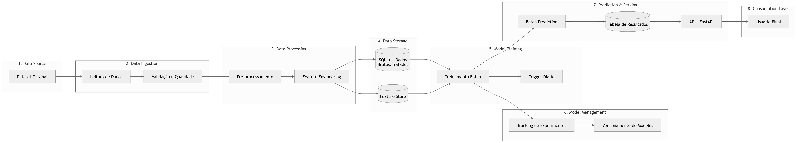

# Arquitetura de dados e modelagem
#### 🔷A adoção de uma arquitetura **batch** para este projeto foi definida com base nas características do problema e nos requisitos de negócio.

 
Primeiramente, o processo de predição não demanda <strong>baixa latência ou inferência em tempo real</strong>, uma vez que os resultados podem ser atualizados em janelas periódicas (diárias) sem impacto significativo para o usuário final. Dessa forma, a execução em lote se torna mais eficiente e adequada, evitando a complexidade adicional de uma arquitetura de streaming ou online.
 
Além disso, o treinamento do modelo é realizado com base em dados históricos consolidados, o que favorece o uso de pipelines batch para garantir <strong>reprodutibilidade, consistência e controle de versões</strong>. A utilização de um agendamento diário permite incorporar novos dados de forma estruturada, mantendo o modelo atualizado sem necessidade de processamento contínuo.
 
Outro ponto relevante é a <strong>simplicidade operacional</strong>. A arquitetura batch reduz a necessidade de infraestrutura distribuída complexa, tornando o sistema mais fácil de manter, monitorar e escalar de forma incremental. Isso é especialmente importante considerando o contexto do projeto, que utiliza tecnologias como SQLite e pipelines locais.
 
Do ponto de vista de engenharia de dados e MLOps, a separação em camadas (ingestion, processing, training, serving) dentro de um fluxo batch permite maior <strong>modularização do pipeline</strong>, facilitando testes, rastreabilidade (tracking) e evolução futura da solução, como a migração para uma arquitetura híbrida (batch + real-time), caso necessário.
 
Por fim, a escolha dessa abordagem também otimiza o <strong>custo computacional</strong>, uma vez que os recursos são utilizados apenas em momentos específicos (execução do pipeline), evitando consumo contínuo de processamento.
 
