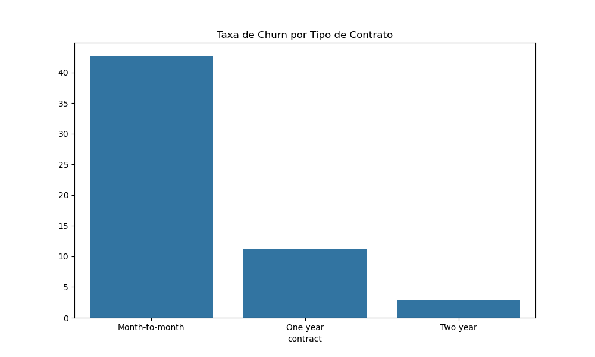
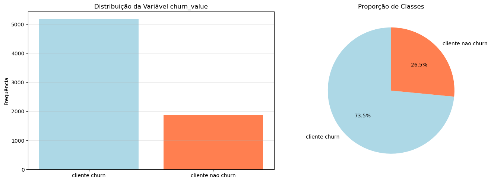
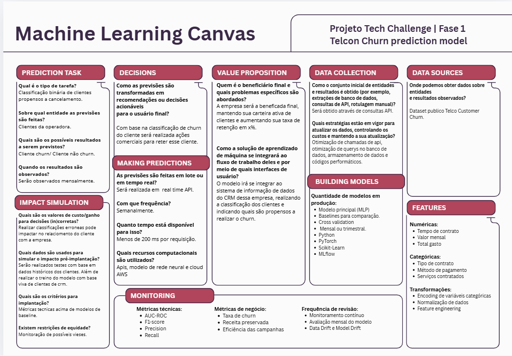

# 📊 Model Canvas: Predição de Churn

## 🔍 Cenário atual - Alta taxa de churn 
Operadora de telecom enfrenta churn elevado na sua base de clientes. Diante desse enário, precisam de um projeto que entregue um pipeline end-to-end com modelo MLP (PyTorch), validação e métricas para priorização de retenção.

## 🎯 Objetivo
O princiapal objetivo é identificar clientes com maior risco de cancelamento rapidamente. Isso inclui:
- Classificação binária supervisionada;
- Pré-processamento de dados de entrada;
- Avaliação de métricas de modelo de baseline;
- Predição de churn de clientes.

## 🎲 Dados utilizados
- Fonte principal: dataset Telco_Customer_Churn.csv (https://www.kaggle.com/datasets/blastchar/telco-customer-churn)

## 📉 Diagnóstico e Impacto
Após uma análise exploratória dos dados, identificamos as seguintes principais informações:
- **Volume do problema:** 1.869 churners (26,5% da base).
- **Custo estimado:** R$ 139.000/total em receita perdida.
- **Insight principal:** clientes churners têm ticket médio de R$ 73,02/mês e prevalecem em contratos mensais (sem fidelidade).

## 👥 Stakeholders e utilização do modelo
- **Usuário Final:** CRM, Marketing de retenção e Produto.
- **Uso:** dashboards de priorização, scores em campanhas segmentadas e automações com alertas em tempo real.

## 📏 Métricas de avaliação
1. **Técnica (ML):** 
   - Recall alto (priorizar detecção de churn);
   - AUC-ROC (discriminação);
   - Accuracy;
   - AUC-PR;
   - Precision.

2. **Negócio:** 
   - Diminuição da taxa de churn;
   - Aumento de LTV do cliente.

## 📌 Métricas de impacto estimadas
- Redução de churn de 26,5% para 20% = ~450 clientes retidos.
- Entendimento de impactos em Falsos Negativos e POsitivos tentando minimizar ao máximo perdas financeiras.

# 📜 Model Canvas Board

