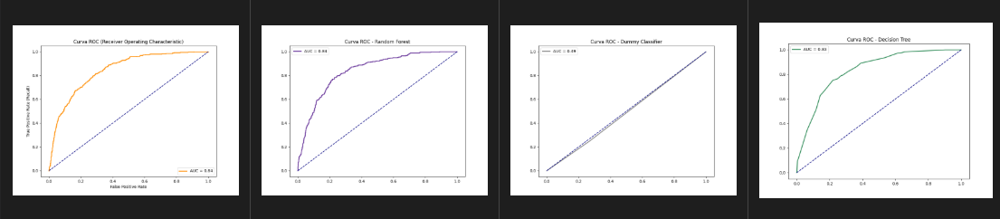
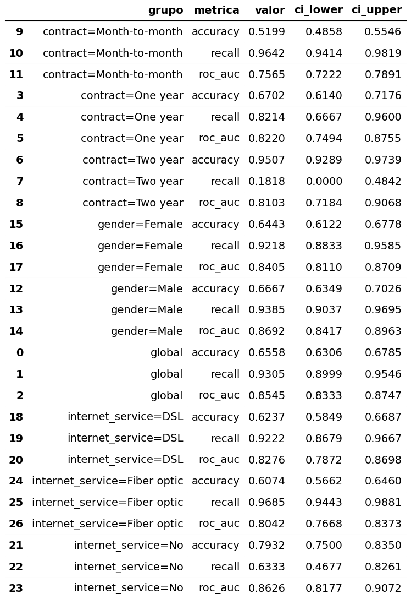

# Tech Challenge - Fase 1 | Model Card

## 🔶 1. Model details

```
1. Responsável pelo modelo: Lara Gonçalves;
2. Data de treinamento do modelo: 25/04/2026;
3. Versão atual do treinamento: 7;
4. Tipo de modelo: Modelo de rede neural multicamadas.
```

## 🔶 2. Intended Use

O modelo de rede neural multicamadas foi desenvolvido para **classificar os clientes que são propensos ao churn (cancelamento do produto)**. 

O modelo será utilizado pela equipe de CRM da empresa, no qual será responsável pela comunicação e campanhas de retenção para os clientes que estão classificados como possíveis churn na base final.

Este modelo **não** tem a intenção de identificar outros comportamentos do cliente com a empresa a não ser a propensão ao churn, portanto nao deve ser utilizado para prospecção de leads, campanhas de novos produtos ou outros.

## 🔶 3. Factors

### Fatores Relevantes que Influenciam o Desempenho

A análise dos dados evidencia que o desempenho do modelo é fortemente influenciado por determinadas subpopulações e características de negócio. 
 Observa-se inicialmente um **desbalanceamento de classes**, com 73.46% de clientes não churn (5174) e 26.54% de churn (1869), o que impacta diretamente na identificação da classe minoritária. <br> Entre os principais fatores, destaca-se o **tipo de contrato**, sendo clientes _month-to-month_ significativamente mais propensos ao churn (42.71%), enquanto contratos de longo prazo apresentam taxas muito menores (11.27% para um ano e 2.83% para dois anos). Outro fator relevante é o **valor de cobrança mensal**, onde clientes que churnam possuem, em média, maior custo de ticket médio, indicando possível sensibilidade a preço.

Além disso, a combinação de serviços também influencia o comportamento: clientes com **fibra óptica e telefone** apresentam a maior taxa de churn (41.89%), enquanto clientes sem internet possuem risco significativamente menor (7.40%). Esses padrões indicam que o modelo pode apresentar variações de desempenho entre grupos com perfis de serviço distintos.


Foram considerados na avaliação fatores estruturais do dataset, como tipo de contrato, serviços contratados, tempo de relacionamento (tenure) e cobrança mensal, por apresentarem maior correlação com churn. Por outro lado, fatores externos ao dataset — como satisfação do cliente, concorrência, condições econômicas ou qualidade do atendimento — foram omitidos por não estarem disponíveis na base, o que representa uma limitação importante. 
Dessa forma, o modelo deve ser interpretado como uma aproximação baseada em dados transacionais, podendo não capturar integralmente a complexidade do churn no mundo real.

## 🔶 4. Metrics

### Métricas de Desempenho e Impacto

A escolha do modelo final foi guiada pela minimização do Custo Total, priorizando o ROC_AUC para identificar a melhor separação de entre as classes.

```
AUC-ROC (Métrica de Separação): 0.847
```


Indica uma excelente capacidade do modelo em distinguir entre clientes de alto e baixo risco, mantendo a estabilidade em diferentes pontos de corte.

```
Custo Total (Métrica de Negócio): R$ 37.635,00
```

Representa a melhor eficiência financeira entre todos os modelos testados, reduzindo o prejuízo causado por Falsos Negativos (R$ 325/cliente).

```
Recall: 92,78%
```

Alta sensibilidade para garantir que quase a totalidade dos potenciais churns receba uma ação preventiva.


### Threshold de Decisão.

```
Threshold Aplicado: 0.30
```

**Justificativa**: O ponto de corte foi otimizado para favorecer o custo financeiro. Dado que um Falso Negativo custa 5x mais que um Falso Positivo, o threshold de 0.30 permite que o modelo seja mais "conservador" em relação à retenção, agindo preventivamente em uma base maior de clientes para garantir a proteção do MRR (Monthly Recurring Revenue).

### Estimativa de Incerteza e Validação

A robustez dos dados reportados é garantida por:

- **Validação em Teste Cego**: As métricas foram extraídas de um conjunto de teste (20% dos dados) totalmente isolado durante o treinamento e ajuste de hiperparâmetros.
- ** Estratificação de Classe **: Utilização de Stratified Shuffle Split para assegurar que a distribuição de churn no teste reflita a realidade do negócio, evitando métricas inflacionadas por amostras não representativas.
- ** Prevenção de Overfitting **: Implementação de Early Stopping e monitoramento de loss em tempo real via MLflow, garantindo que o AUC-ROC reportado seja generalizável para novos dados de produção.

## 🔶 5. Evaluation Data

### Datasets utilizados

O modelo foi avaliado utilizando o dataset público **Telco Customer Churn (IBM)** disponível no Kaggle.
 Este dataset contém aproximadamente **7.043 registros de clientes e 33 variáveis**, incluindo dados demográficos, serviços contratados e informações financeiras, além da variável alvo de churn.

### Motivação da escolha

A escolha desse dataset se deve a:

- Possuir **variáveis relevantes de negócio** (ex: tenure, tipo de contrato, serviços, faturamento), que refletem cenários reais de retenção de clientes.
- Ter um problema bem definido de classificação binária (churn vs. não churn).

### Dados públicos e reprodutibilidade

- O dataset é **público e acessível via Kaggle**, permitindo reprodução dos experimentos.
- Os dados são derivados de um **dataset amostral da IBM**, amplamente documentado e utilizado em estudos acadêmicos e práticos.

### Pré-processamento aplicado

Foi aplicado o seguinte pré-processamento:

- Tratamento de valores nulos (ex: imputação ou remoção)
- Codificação de variáveis categóricas (ex: One-Hot Encoding)
- Padronização/normalização de variáveis numéricas (quando necessário)
- Conversão da variável alvo para formato binário (0/1)
- Separação entre treino e teste

Essas etapas garantem consistência dos dados e evitam vazamento de informação durante a avaliação do modelo.

## 🔶 6. Training Data

### Dataset de treino

O modelo foi treinado utilizando o dataset público **Telco Customer Churn (IBM)**, o mesmo utilizado na etapa de avaliação, com divisão entre conjuntos de treino e teste.

### Coleta e rotulagem

- Os dados são disponibilizados pela IBM e amplamente utilizados para estudos de churn.
- A variável alvo (**Churn**) já está **previamente rotulada** no dataset, indicando se o cliente cancelou o serviço (Yes/No).

### Filtros e amostragem

- Tratamento de registros com **valores ausentes** (ex: `TotalCharges` 11 linhas vazias).
- Conversão de variáveis categóricas para formato adequado (ex: encoding).
- Separação entre variáveis preditoras e variável alvo.
- Divisão dos dados em treino e teste (80/20), garantindo que o conjunto de treino não contenha dados do teste.
- Estratificação das classes devido ao desbalanceamento do dataset
- **Normalização/padronização** de variáveis numéricas.

## 🔶 7. Quantitative Analyses

### Visão geral

- **Taxa de churn geral**: 26.54% (1869 de 7043 clientes)
- **Desbalanceamento de classes**: ~73.5% não churn vs ~26.5% churn
- **Ticket médio**:
- Churn: 73.02
- Não churn: 61.46
→ Clientes que churnam possuem, em média, maior receita mensal.

---

### Comportamento por subgrupos

#### Tipo de contrato

- Month-to-month: **42.71%**
- One year: **11.27%**
- Two year: **2.83%**

Observação: Forte evidência de que contratos mais longos reduzem churn.

---

#### Internet Service x Phone Service

- Fiber optic + Phone: **41.89%** (maior churn)
- DSL + Phone: **16.62%**
- DSL sem Phone: ~25%
- Sem internet + Phone: **7.40%** (menor churn)

Observação: Clientes com fibra apresentam maior risco de churn.

---

#### Geografia (Top cidades)

- San Diego: **33.33%**
- San Francisco: **29.81%**
- Los Angeles: **29.51%**
- San Jose: **25.89%**
- Sacramento: **24.07%**

Observação: Variação moderada entre cidades (~24% a ~33%).

---

#### Correlações relevantes

- `tenure` vs churn: **-0.35** → quanto maior o tempo, menor churn
- `monthly_charges` vs churn: **0.19** → leve associação positiva
- `churn_score` vs churn: **0.66** → forte relação (esperado)
- `cltv` vs churn: **-0.13** → leve relação negativa

---

### 

### Intervalos de Confiança (IC)

#### Tabela comparativa das métricas + ICs:

[▫️Tabela comparativa de cada experimento](./docs/results.md)

Os intervalos de confiança (IC 95%) foram estimados via bootstrap para avaliar a **robustez das métricas do modelo** (accuracy, recall e ROC AUC), tanto no nível global quanto por subgrupos.

De forma geral, o modelo apresenta **boa estabilidade no agregado**, com intervalos relativamente estreitos. No entanto, a análise segmentada revela diferenças importantes:

- **Contratos month-to-month**: alto recall, porém com menor acurácia → o modelo tende a priorizar a detecção de churn nesse grupo
- **Contratos two year**: alta acurácia, mas recall muito baixo e com maior incerteza → risco de não detectar churn (falsos negativos)
- **Fiber optic**: recall elevado com perda de acurácia → possível viés para classificar churn nesse perfil

Além disso, alguns subgrupos apresentam **intervalos mais amplos**, indicando maior variabilidade e menor confiabilidade das estimativas, especialmente onde há menor volume de dados.

Observação:  Esses resultados evidenciam **gaps de performance entre segmentos**, reforçando a necessidade de avaliação de fairness.

## 🔶 8. Ethical Considerations

### Uso de dados sensíveis

- O dataset **não contém dados sensíveis diretos**, como informações de saúde, raça ou orientação sexual.
- Inclui apenas dados demográficos básicos (ex: gênero, senioridade), serviços contratados e informações financeiras.

### Riscos de uso indevido

- **Decisões automatizadas injustas**: uso do modelo para negar benefícios ou ofertas pode impactar negativamente certos grupos de clientes.
- **Uso fora de contexto**: aplicar o modelo em populações diferentes da base original pode gerar decisões incorretas.

### Mitigações aplicadas

- **Técnicas**:
- Monitoramento de métricas por subgrupos (ex: gênero, senioridade), quando possível.
- Avaliação de métricas além da acurácia (ex: recall, precision), reduzindo impactos assimétricos.
- **Processo**:
- Uso do modelo como **apoio à decisão**, não como decisão final automatizada.
- Validação contínua com dados atualizados.
- **Contratuais/organizacionais**:
- Restrição de uso do modelo apenas para **estratégias de retenção e marketing**, evitando aplicações sensíveis (ex: crédito, elegibilidade).

## 🔶 9. Caveats and Recommendations

### Cenários não testados

- O modelo não foi validado em:
- Outras indústrias ou segmentos fora de telecom.
- Bases com distribuição de dados significativamente diferente (data drift).
- Cenários em tempo real (streaming ou decisões online).

### Limitações conhecidas

- Dataset relativamente pequeno (~7k registros), podendo limitar generalização.
- Possível **desbalanceamento da variável alvo (churn)**, impactando métricas.
- O modelo não captura fatores externos relevantes (ex: concorrência, contexto econômico, satisfação do cliente).

Essas limitações devem ser consideradas ao interpretar os resultados e antes da adoção em ambientes produtivos.